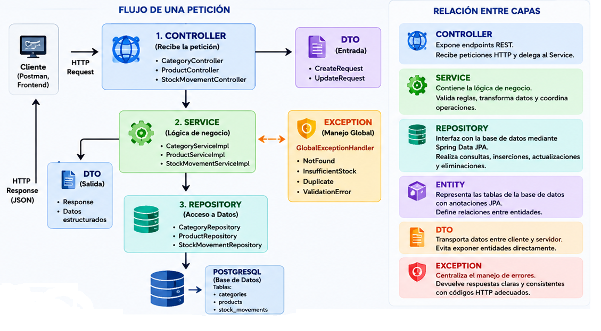
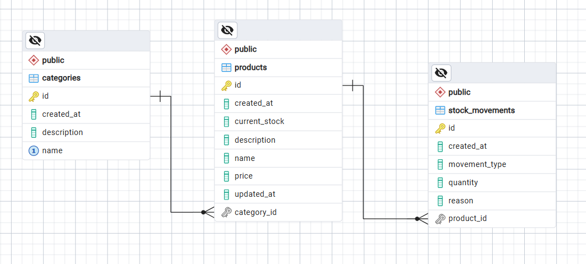

# StockControl API Spring Boot

  <strong>API REST para control de inventario, productos, categorías y movimientos de stock usando Java, Spring Boot, Spring Data JPA y PostgreSQL.</strong>

  
  
  
  
  

---

## Descripción

**StockControl API Spring Boot** es una API REST desarrollada como proyecto de portafolio profesional para demostrar conocimientos de desarrollo Backend Java.

El sistema permite gestionar:

- Categorías de productos.
- Productos asociados a una categoría.
- Entradas de stock.
- Salidas de stock.
- Historial de movimientos.
- Validación de stock insuficiente.
- Manejo global de errores.

Este proyecto aplica una **arquitectura por capas**, buenas prácticas de **Clean Code**, uso de **DTOs**, validaciones, excepciones personalizadas y persistencia real con **PostgreSQL**.

---

## Objetivo del proyecto

El objetivo principal es construir una API pequeña, realista y profesional que demuestre competencias clave para un perfil de:

- Desarrollador Backend Java.
- Desarrollador Full Stack Java.
- Analista Programador Java.
- Desarrollador Spring Boot Junior / Semi Senior.

---

## Tecnologías utilizadas

| Tecnología | Uso dentro del proyecto |
|---|---|
| Java 21 | Lenguaje principal |
| Spring Boot | Framework backend |
| Spring Web | Creación de endpoints REST |
| Spring Data JPA | Persistencia y repositorios |
| PostgreSQL | Base de datos relacional |
| Jakarta Validation | Validación de datos de entrada |
| Maven | Gestión de dependencias |
| Postman | Pruebas de endpoints |
| Git & GitHub | Control de versiones |

---

## Arquitectura del proyecto

El proyecto utiliza una **arquitectura por capas**:

  

## Diagrama Entidad Relación

  

